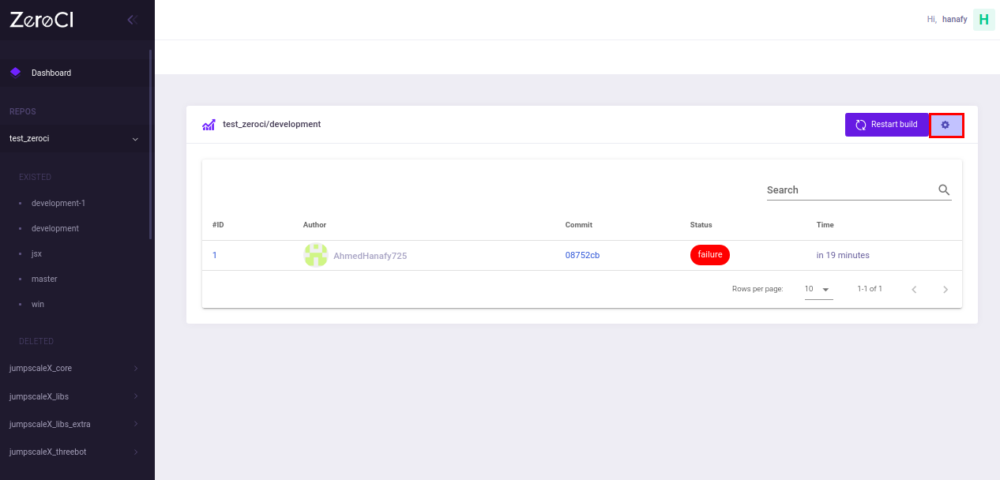
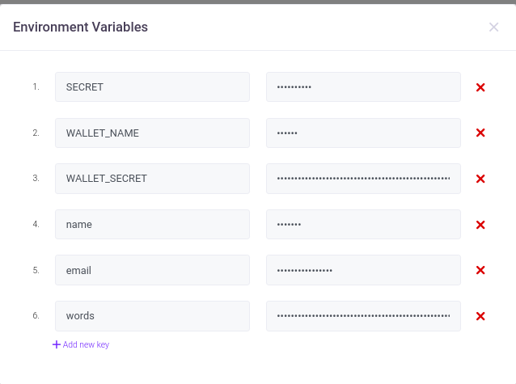
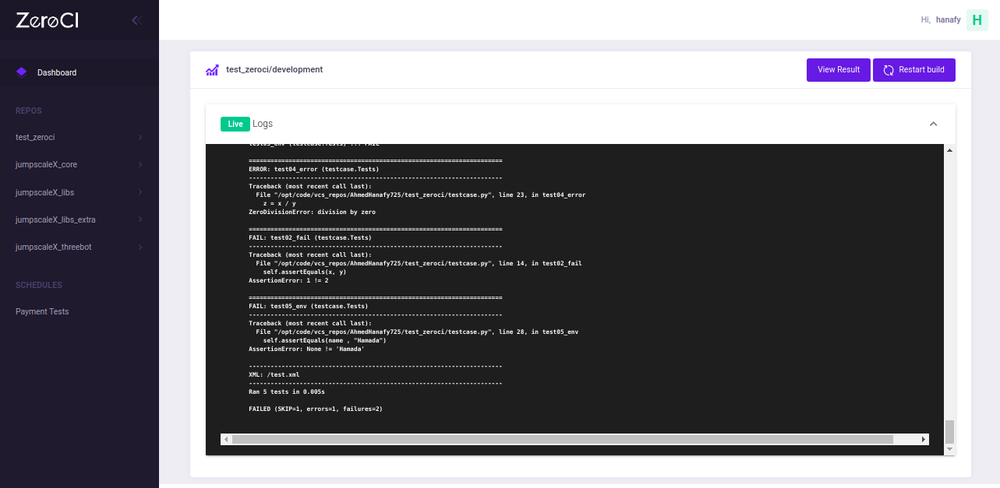
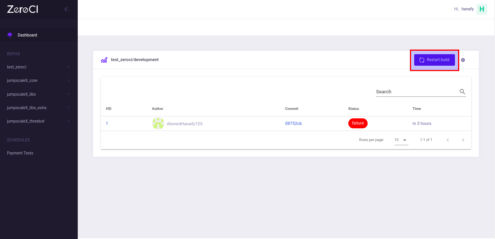
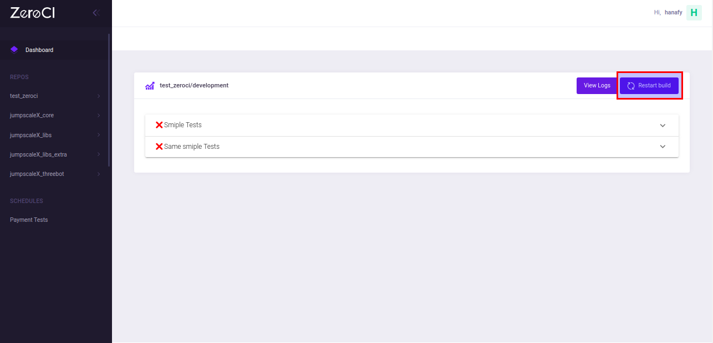

# Zero Continuous Integration

ZeroCI is continuous integration dedicated for python projects that generates test summary into xml file and it is integrated with version control systems and Telegram.

(**Note:** version control systems supported are Github and Gitea)

## ZeroCI life cycle

This [section](/docs/life_cycle.md) is added to talk more about the ZeroCI life cycle and explain how things work internally.

## ZeroCI Installation

For installation and running ZeroCI, please check it [here](/docs/installation.md)

## Version Control System Repository Under Test (RUT) configuration

There are 2 main steps to hook the RUT and make it run against ZeroCI (Github will be token as example):

### 1- Add zeroCI.yaml file to the RUT

- Add a file called `zeroCI.yaml` to the home of your repository.
  
- This file contains the project's jobs (serial jobs with maximum 3 jobs) and every job should contain:
  - `prerequisites`:
    - `image_name`: Docker image name needed to be used for running the project on.
    - `shell_bin`: shell bin path to be used to run commands on container. (default: `/bin/sh`)
  - `install`: list of bash commands required to install the project.
  - `script`: list of bash commands needed to run the tests ([more details](#zeroci-script-configuration)).
  - `bin_path`: In case that the installation script or test script will generate a binary and need this binary to be in zeroci dashboard. This field can be in the first job only and if it is found in the second job, it will be ignored. Also the bin generated in first job will be found in the rest jobs in `/zeroci/bin`.

  (**Note:** RUT location will be in `/zeroci/code/vcs_repos/<organization's name>/<repository's name>`)

### 2- Update ZeroCI configuration

- Go to [ZeroCI configuration](/docs/installation.md#configuration).
- Full name of the repository should be added to repos field.
- Environment variables can be added on RUT page by clicking on settings (⚙️).

  (**Note**: Only ZeroCI's admins and users can change this environment varibles)




## Getting the results

### 1- ZeroCI Dashboard

- Go to server ip.
- Once a commit has been pushed, it will be found with a pending status.
  
- When the test finishes, the status will be updated.
- Press the result ID to view the [result details](#result-details).
  
- Please browse to ZeroCI dashboard to view repos cards in which each card contains  info about current repo, last build status, etc. (**Note:** The default used branch is `master`)
  

### 2- Github status

- Once a commit has been pushed to RUT, if you go to the repository commits, you will find a yellow message indicating that some checks haven't been compeleted yet.
  
- When the tests run finishes, the status will be updated.
  
- Please press 'Details' link to view [result details](#result-details).

### 3- Telegram group chat

- If you want to get a message with the build status on telegram chat, please provide the telegram required info in [ZeroCI configuration](/docs/installation.md#configuration).

  
- Please press the `Result` button for viewing [result details](#result-details) and `Bin` for downloading the binary generated if the location of the bin specified in [zeroci.yaml](#1--add-zerociyaml-file-to-the-rut).
- The name beside `fire emoji` 🔥 for the one who triggers the build (name will be `VCS hook` in case of version control system's hook and `ZeroCI Scheduler` in case of zeroci schedule the job in its time)

## Result details

### Stream logs

Please go to the result while your test is running or press on view logs button after it finishes.



### Formatted result

- Black formatting result will appear at the beginning.
- Then you can see the run results related to the tests added under `script` field in [ZeroCI.yaml](#2--zerociyaml).
  

- For more details about every test, please press on the test name.
  
  (**Note:** if the test run didn't generate xunit test summary into xml file, the result will appear in log format as running in shell.)

## ZeroCI script configuration

This part is important for getting result in this [view](#result-details)

### Nosetests

For more details about the plugin [Xunit](https://nose.readthedocs.io/en/latest/plugins/xunit.html)

- `name`: A name for the commands.
- `cmd`: The commands for running tests.
  `--with-xunit`: to enable the plugin to generate xunit test summary into xml file.
  `--xunit-file`: specify the output file name, in this case MUST be `/test.xml`.  
  `--xunit-testsuite-name`: name of testsuite that will appear in the result.

  **Example**

  ```bash
  nosetests-3.4 -v testcase.py --with-xunit --xunit-file=/test.xml --xunit-testsuite-name=Simple_nosetest
  ```

  See [full example](./docs/config/nosetests.yaml)

### Pytest

For more details about the plugin [junitxml](https://docs.pytest.org/en/latest/usage.html#creating-junitxml-format-files)

- `name`: A name for the commands.
- `cmd`: The commands for running tests.
  `--junitxml`: to enable the plugin and specify the output file name, in this case MUST be `/test.xml`.
  `-o junit_suite_name`: name of testsuite that will appear in the result.

  **Example**

  ```bash
  pytest -v testcase.py --junitxml=/test.xml -o junit_suite_name=Simple_pytest
  ```

### Neph

For more details, please see [neph](https://github.com/tbrand/neph)

- `name`: A name for the job.
- `type`: `neph`
- `working_dir`: Absolute path of working directoty.
- `yaml_path`: Absoltue path of yaml file that containing the jobs.

See [full example](./docs/config/neph.yaml)

### Normal Logs

- `name`: A name for the commands.
- `cmd`: The commands for running tests.

## Actions

Only ZeroCI's admins and users can take this actions.

### Trigger

In repository's branch page, tests can be triggered from last commit of this branch by clicking on restart build button.



### Rebuild

In result page, tests can be triggered from this commit by clicking on restart build button.

(**Note**: By clicking the restart build button,  the current result will be deleted)



## Nightly tests

There is an API for adding nightly testsuite, but its page hasn't been added yet.
