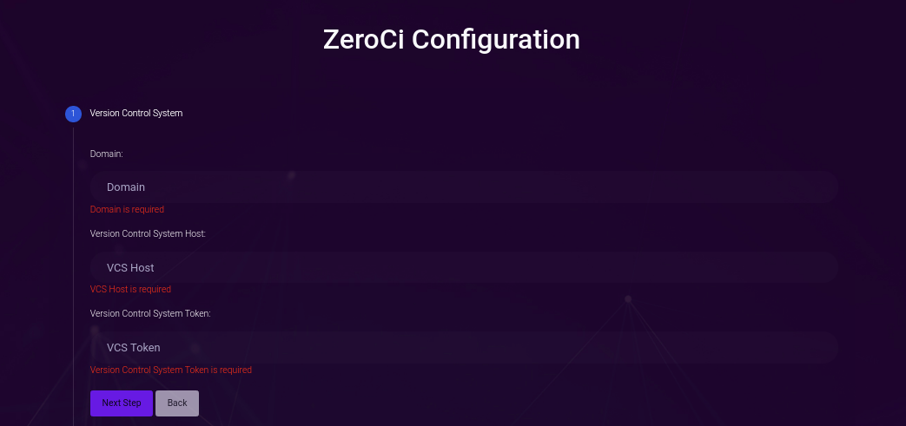
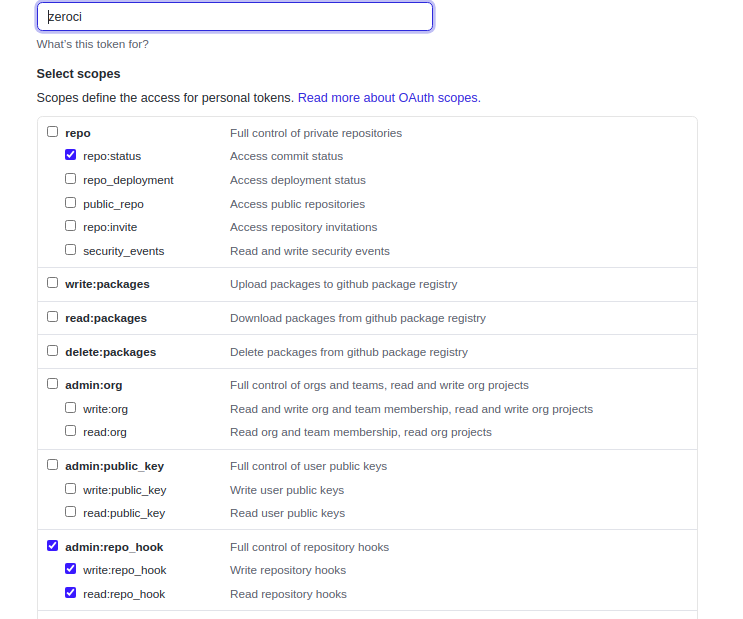
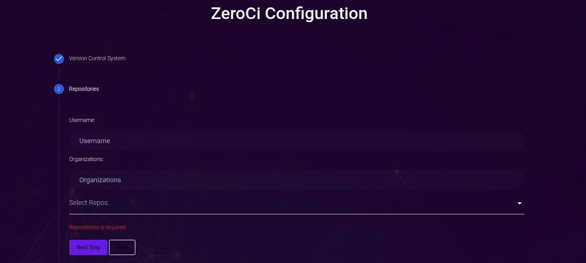
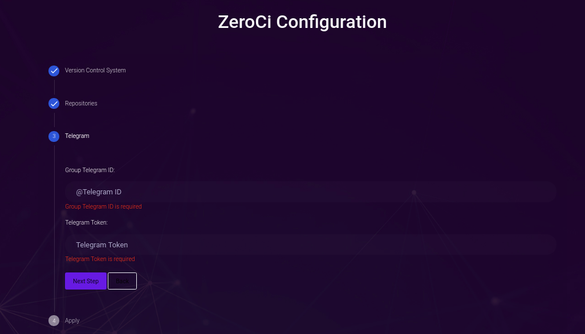

# Installation and Configuration

## Installation

- Create a [kubernetes cluster](https://manual2.threefold.io/#/kubernetes).
- Create a [solution expose](https://manual2.threefold.io/#/exposed) to tls-port 30443 and port 30080
- Connect to the cluster using `ssh`.
- Create zeroci directory and get installation yaml files.

  ```bash
  mkdir ~/zeroci
  cd ~/zeroci
  for s in authorization deployment service redis; do curl https://raw.githubusercontent.com/threefoldtech/zeroCI/development/install/zeroci/$s.yaml --output $s.yaml; done
  ```
- Set ZeroCI domain and should be the same as one on solution expose in the second step.

  ```bash
  sed -i 's/SERVER_DOMAIN/<your server domain>/g' ~/zeroci/deployment.yaml
  ```

  **Example:**
    If you need to set Domain to `zeroci.grid.tf`, so the command will be:

  ```bash
  sed -i 's/SERVER_DOMAIN/zeroci.grid.tf/g' ~/zeroci/deployment.yaml
  ```

- Apply the installation yaml files.

  ```bash
  kubectl apply -f ~/zeroci
  ```

## Configuration

Go to the domain that ZeroCI has been deployed on, you will be asked for login first, then please fill the following configurations:

### 1- Version Control System



- **Domain**:  The domain that will point to your server, this will be used to add webhooks on the repositories (will be added in [Repositories](#2--repositories) step) and send the result link with it.
- **Version Control System Host**: The domain or ip that the version control system is running on.
(**Note:** [Github](https://github.com) and [Gitea](https://gitea.io/en-us/) are only supported)
- **Version Control System**: Version control system access token for user, [create one](https://help.github.com/en/github/authenticating-to-github/creating-a-personal-access-token) and make sure that this token his full permission on hooks and status as the following:


  
### 2- Repositories



- **Username:** A username on Version Control System that has been added in the pervious step to search and get his public repositories.

- **Organization** : An organization on Version Control System that has been added in the pervious step to search and get the public repositories on this organization.

(**Note:**`username` and/or `organization` can be added.)

- **Select Repos**: Once the username and/or organization is added, the dropdown list will be available to select the repositories that ZeroCI will run on.

### 3- Telegram



- **Telegram Chat ID**: a Telegram Channel or Group ID that the result messages will be sent on. (**Note:** it should start with `@`)

- **Telegram Bot**: Telegram bot token that will be used to send the result messages, [Create one](https://core.telegram.org/bots#3-how-do-i-create-a-bot) and add it to this Channel.

(**Note**: Once the configuration is done, ZeroCI will set you as admin, and this configuration can be changed only by admins)
